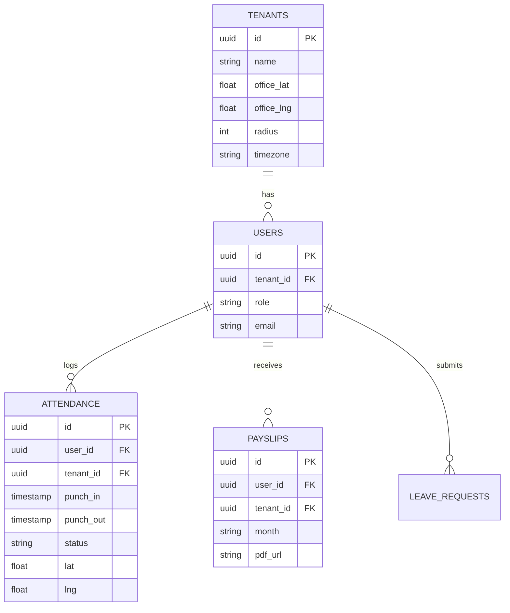
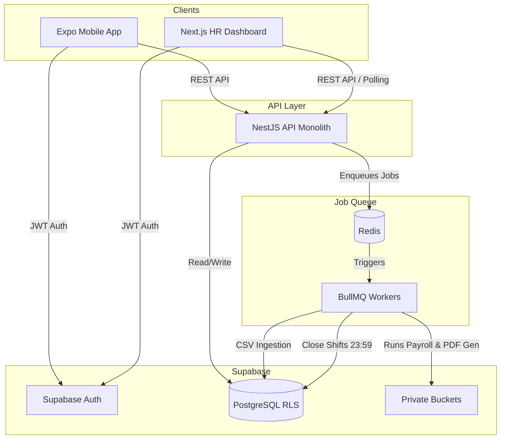
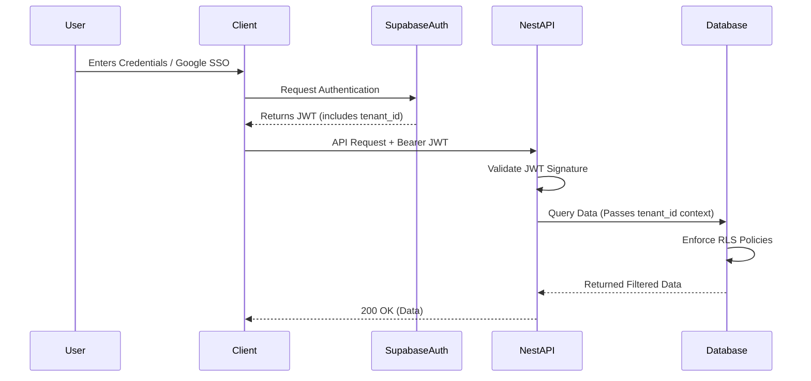
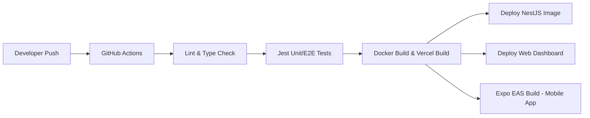

# ARCHITECTURE.md

## Section 0 — Single Source of Truth (SSOT)

This section serves as the foundational `ARCHITECTURE.md` for the EmpFlow project. It dictates structural rules for all code generation and system extensions.

### Tech Stack (Pinned Versions)
*   **Mobile Frontend:** Expo v51.x, React Native v0.74.x
*   **Web Frontend:** Next.js v14.x (App Router), React v18.x
*   **Backend:** NestJS v10.x, Node.js v20.x, TypeScript v5.x
*   **Database & Auth:** Supabase (PostgreSQL 15), Supabase Auth, Supabase Storage
*   **Background Processing:** BullMQ v5.x, Redis v7.x
*   **State Management / Data Fetching:** TanStack React Query v5.x (for HTTP polling)

### Module Boundaries & Naming Conventions
*   **Frontend Modules (`src/modules/`):** `auth`, `employees`, `attendance`, `leaves`, `payroll`, `reports`, `admin`.
*   **Backend Modules (`src/modules/`):** `auth`, `organizations`, `employees`, `attendance`, `leave`, `payroll`, `payslip`, `notifications`, `data-ingestion`.
*   **File Naming:** `kebab-case.ts` for files, `PascalCase.tsx` for React components.
*   **Import Rules:** Cross-module imports are strictly prohibited. Modules expose a `contracts.ts` or `index.ts` file for public DTOs and interfaces. 

### Shared Type Definitions (Core Entities)
```typescript
// core/types/shared.ts
export interface Tenant {
  id: string;
  name: string;
  officeLat: number; 
  officeLng: number; 
  radius: number; 
  timezone: string;
}

export interface User {
  id: string;
  tenantId: string; 
  role: 'SUPER_ADMIN' | 'TENANT_ADMIN' | 'HR_MANAGER' | 'LINE_MANAGER' | 'EMPLOYEE'; 
  email: string; 
  managerId?: string; 
}

export interface Attendance {
  id: string;
  userId: string; 
  tenantId: string; 
  punchIn: string; // ISO 8601
  punchOut?: string; // ISO 8601
  status: 'PRESENT' | 'ANOMALY_MISSED_PUNCH' | 'REGULARIZED'; 
  lat: number; 
  lng: number; 
}
```

### API Contract & Error Envelope
All backend responses must wrap data or errors in standard envelopes.

```typescript
// Request Envelope (Example)
export interface ApiRequest<T> {
  data: T;
}

// Success Response Envelope
export interface ApiResponse<T> {
  data: T;
  meta?: {
    pagination?: { page: number; limit: number; total: number };
  };
}

// Error Response Envelope
export interface ApiError {
  error: {
    code: string;
    message: string;
    details?: any;
  };
}
```

### Environment Variable Schema
```env
# Database & Auth
SUPABASE_URL=string
SUPABASE_ANON_KEY=string
SUPABASE_SERVICE_ROLE_KEY=string
DATABASE_URL=string

# Redis / Jobs
REDIS_HOST=string
REDIS_PORT=number
REDIS_PASSWORD=string

# App Configuration
PORT=number
JWT_SECRET=string
FRONTEND_WEB_URL=string
```

## Section 1 — UI & Frontend
The frontend is split across two applications: a Next.js web dashboard and an Expo React Native mobile app. Both leverage a modular structure where domain-specific logic is encapsulated.

Design Pattern: Atomic Design (Atoms, Molecules, Organisms) localized within module boundaries.

State Management: React Query is used for remote state management. V1 relies on standard client-side API polling (e.g., 30-60 second intervals for attendance dashboards) to meet live update requirements without WebSocket overhead.

Accessibility: WAI-ARIA compliant web components; standard React Native accessibility labels for mobile.

### Directory Layout (Next.js / Expo)
```
src/
├── core/
│   ├── components/       # Shared UI library (buttons, inputs)
│   ├── hooks/            # Global hooks (useAuth)
│   ├── api/              # Axios/Fetch wrapper with interceptors
│   └── theme/            # Tailwind configs / styling tokens
└── modules/
    ├── attendance/
    │   ├── components/   # Local UI components
    │   ├── hooks/        # Data fetching (e.g., useAttendanceData)
    │   └── types.ts      # Local interface contracts
    └── payroll/
```

## Section 2 — Backend & Architecture
The NestJS backend operates as a Modular Monolith. Domains handle their own business logic, routing, and database interaction via Supabase PostgreSQL, while asynchronous background processing is offloaded to BullMQ workers backed by Redis.

### Module Responsibilities
* **Core:** Middleware for Supabase Auth JWT validation, logger, global exception filters, and Redis connection pools.
* **Organizations:** Tenant provisioning, timezone configuration, and SSO setup.
* **Attendance:** Point-in-time GPS validation (Haversine formula check against office radius).
* **Jobs (BullMQ Workers):** Handles asynchronous workflows—daily attendance closure at local tenant time (23:59), batch PDF payslip generation, and bulk CSV data ingestion.

### Database Schema Interfaces
```typescript
// core/schemas/db.ts
export interface LeaveRequest {
  id: string;
  userId: string;
  tenantId: string;
  type: 'SICK' | 'ANNUAL' | 'UNPAID';
  startDate: string;
  endDate: string;
  status: 'PENDING' | 'MANAGER_APPROVED' | 'HR_APPROVED' | 'REJECTED';
}

export interface Payslip {
  id: string;
  userId: string; 
  tenantId: string; 
  month: string; // YYYY-MM
  pdfUrl: string; 
  base: number; 
  allowances: number; 
  deductions: number; 
}
```

### ER Diagram


### System Flow Diagram


## Section 3 — Integrations

### Internal API Contracts
Geofenced Clock-In Check:

```typescript
// POST /attendance/clock-in
// Request
{
  "lat": 17.6868,
  "lng": 83.2185,
  "timestamp": "2026-09-22T08:50:00Z"
}

// Response (Success)
{
  "data": { "status": "PRESENT", "id": "uuid-123" }
}

// Response (Error - Outside Geofence)
{
  "error": { "code": "ERR_OUT_OF_BOUNDS", "message": "You must be within 200m of the office." }
}
```

### External Integrations
* **Supabase Storage:** Utilized for storing generated PDF payslips. Files are restricted from public access. The API generates temporary signed URLs with a 15-minute expiration window for secure client downloads.
* **Expo Push:** Outbound integration from the Notification module/worker to dispatch push alerts for missed punches, leave approvals, and announcements.

## Section 4 — Security
* **Row-Level Security (RLS):** Supabase database heavily utilizes Postgres RLS. Every table includes a tenant_id. RLS policies mathematically prove users can only access data belonging to their provisioned tenant.
* **Document Storage:** PII and payslips are stored in Supabase private buckets. No document is publicly routed; access requires temporary signed URLs.
* **Geospatial Forgery:** Mitigate GPS spoofing by requiring OS-level location provider integrity checks (Android Mock Location detection, iOS accurate location mandates) via React Native plugins prior to capturing [Lat, Lng].

### Authentication Flow (Mobile & Web)


### RBAC Matrix
| Role | Resource | Create | Read | Update | Delete | Notes |
| --- | --- | --- | --- | --- | --- | --- |
| Super Admin | Tenants | ☑ | All | ☑ | X | SaaS platform mgmt |
| Tenant Admin | All Org Data | ☑ | Tenant | ☑ | Soft | Full access within tenant_id |
| HR Manager | Payroll/Leaves | ☑ | Tenant | ☑ | X | Cannot alter company policies |
| Line Manager | Team Data | - | ☑ Reports | ☑ (Approve) | X | View/approve for direct reports only |
| Employee | Own Data | ☑ (Punches) | Own only | X | X | View own profile, payslips |

## Section 5 — Testing
* **Strategy:** Testing is layered across independent domain modules to ensure the monolith remains loosely coupled.
* **Unit Testing:** Handled via Jest. Focus on business logic integrity, specifically the automated payroll math engine (Base + Allowances - Deductions) and the Haversine distance calculator.
* **Integration Testing:** Handled via Supertest within NestJS. Validates API boundaries, HTTP status codes, and JWT validation middleware.
* **E2E Target:** 80% coverage on core HR compliance workflows (Clock-in, Leave Approval, Missed Punch regularisation). Supabase Local instance will be used in CI to test RLS policies directly.

## Section 6 — DevOps & Deployment
* **Hosting Configuration:** The NestJS API and BullMQ worker processes are deployed via containerized environments (Docker) onto managed platforms like Render, AWS ECS, or DigitalOcean App Platform. Next.js Web Dashboard hosted on Vercel.
* **Environment Variable Management:** Secrets injected at build/runtime via hosting platform vaults. No .env files checked into source control.
* **Monitoring Baseline:** Application Performance Monitoring (APM) attached to backend Node instances targeting < 800ms API response times (Geofence checks) and < 5 seconds for PDF worker generation times.

### CI/CD Pipeline

